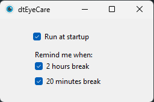

# WinEyeCare
WinEyeCare is a free Windows app that helps you protect your eyes while working on your computer.

## Description
WinEyeCare is a free Windows app that helps you protect your eyes while working on your computer. It runs quietly in the background and sends you a notification every 20 minutes to take a short break, and every 2 hours to take a longer one. These regular reminders help reduce eye strain and keep you feeling refreshed throughout the day. Just launch the app and it takes care of the rest, no complicated setup needed.

## Screenshots
| App Startup | Notification Toast |
|---|---|
|  |  |

## Getting Started

### Dependencies
* Windows 10 or later
* No additional dependencies required, WinEyeCare is a standalone executable

### Installing
* Download the latest release from the [Releases](https://github.com/dincertekin/wineyecare/releases/latest) page
* No installation needed, simply extract and run the executable

### Executing program
* Double-click `WinEyeCare.exe` to launch the application
* The app will start running in the background and appear in the system tray
* Double-click the system tray icon to access settings and customize break intervals and startup preferences

## Help
If the app does not appear in the system tray, check that your system tray is not hiding icons. You can manage this in Windows taskbar settings.

## Contributing
Contributions are welcome! To get started:
1. Fork the repository
2. Create a new branch (`git checkout -b feature/your-feature`)
3. Commit your changes (`git commit -m 'Add your feature'`)
4. Push to the branch (`git push origin feature/your-feature`)
5. Open a Pull Request

Please open an issue first for major changes to discuss what you'd like to change.

## License
This project is licensed under the [MIT](LICENSE) License, see the LICENSE.md file for details
